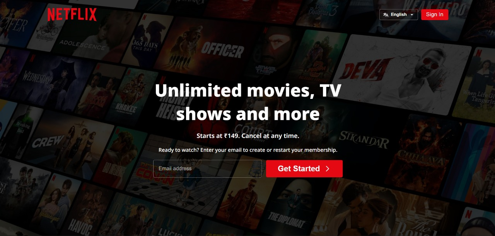
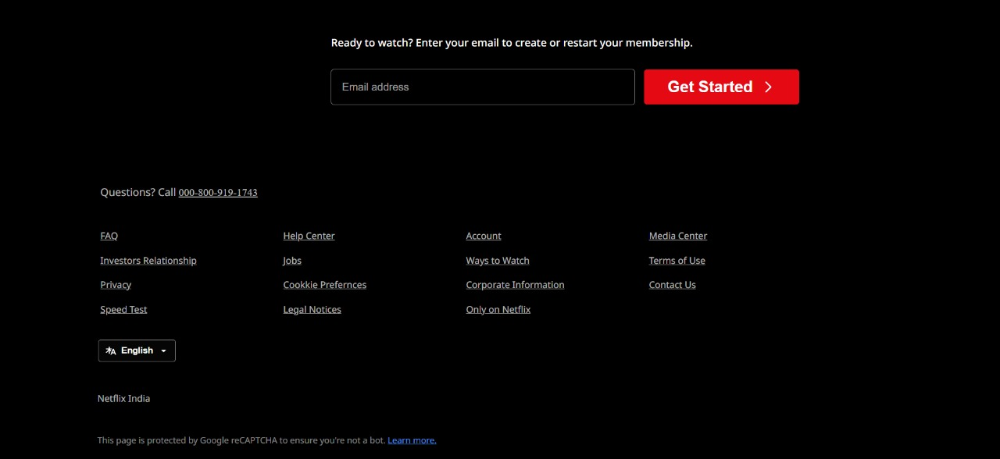
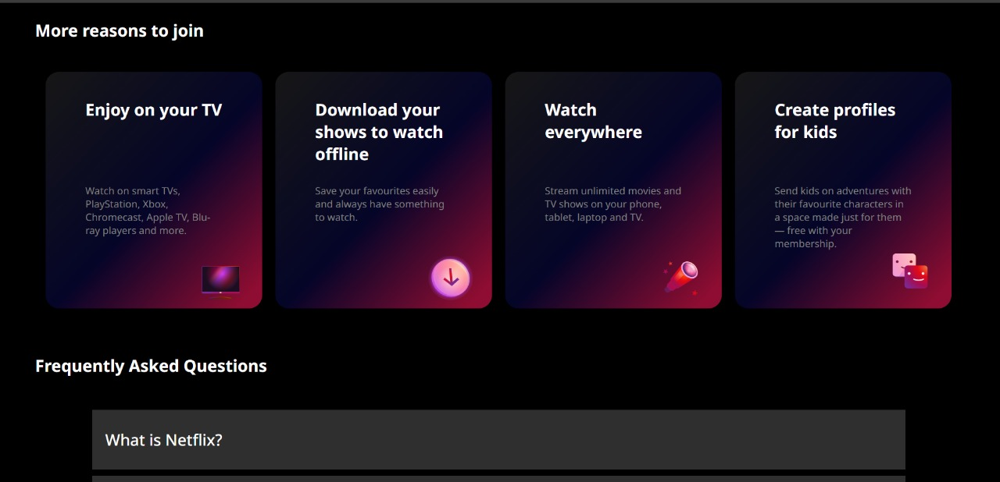

# Netflix Clone (HTML & CSS Only)

> A simple, non-responsive Netflix homepage clone built using only HTML and CSS.  
> Desktop layout only — no JavaScript, no frameworks, no API.

LIVE PREVIEW :- https://sohamghadai42.github.io/MOVIE-UI-CLONE/
---

## Demo / Screenshot
Screenshot to show the page:

 ---> first page image
 ---> second page image
 ---> third page image
 ---> fourth page image

---

## What this is
- Static HTML + CSS project that mimics the Netflix homepage UI.
- Focus: layout, positioning, hover effects, typography, and dark theme.
- NOT responsive — designed for a desktop width.

---
